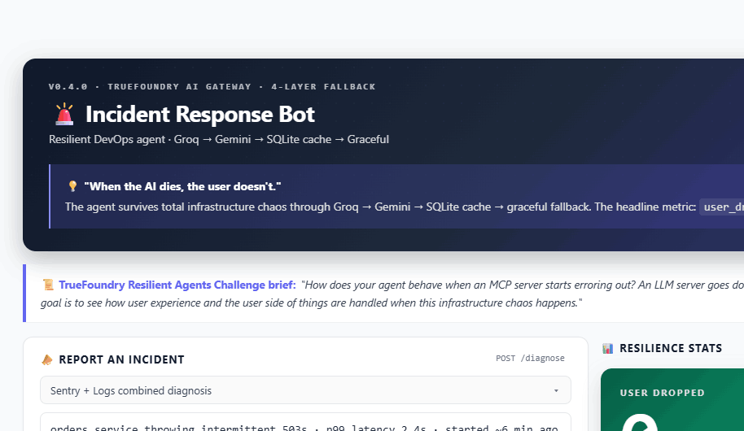

# 🚨 Incident Response Bot

> **"When the AI dies, the user doesn't."**
> An incident response agent that stays online through a 4-layer resilience chain.
> Built for **DevNetwork [AI + ML] Hackathon 2026 — TrueFoundry Resilient Agents Challenge**.

[](https://www.python.org/)
[](https://fastapi.tiangolo.com/)
[](https://www.truefoundry.com/)
[](https://streamlit.io/)
[](https://discord.com/)



> The control dashboard color-codes every response by **source** (🟢 live · 🟡 cache · 🔴 graceful) and keeps the headline **`user_dropped`** metric front and center.

---

## 🎯 Challenge Alignment (1:1 Mapping)

From the **TrueFoundry Resilient Agents Challenge** brief:

> *"How does your agent behave when an MCP server starts erroring out? An LLM server goes down? OpenAI or Claude errors out or browns out? The goal is to see **how user experience and the user side of things are handled** when this infrastructure chaos happens and **how your agent is configured and set up for success and resilience**."*

| Challenge Keyword | Our Implementation | Demo Asset |
|---|---|---|
| "MCP server erroring out" | Mock MCP tools with graceful error returns | `/chat/tools` w/ tool failure |
| "LLM server goes down" | `CHAOS_MODE` toggle simulates total LLM failure | `POST /chaos/toggle` |
| "OpenAI/Claude browns out" | TrueFoundry Gateway auto-fallback Groq → Gemini | Gateway logs |
| "User experience handled" | SQLite cache returns last-known answer | `source: "cache"` (UX identical to live) |
| "Agent configured for resilience" | 4-tier fallback chain (live → cache → graceful) | `source` field in every response |
| **Bottom line** | **`user_dropped_count: 0`** even when 2 layers fail | `GET /stats` |

---

## 🏗 Architecture — 4-Layer Resilience Chain

```
                          ┌─────────────────────┐
                          │  Entry Points       │
                          │  • Discord bot      │
                          │  • Streamlit UI     │
                          │  • REST API         │
                          └──────────┬──────────┘
                                     │
                                     ▼
                          POST /chat/tools
                                     │
                                     ▼
                  ┌──────────────────────────────────┐
                  │   chat_with_tools (wrapper)      │
                  │   - resilience layer             │
                  │   - stats.record() per response  │
                  └──────────┬───────────────────────┘
                             │
            ┌────────────────┼────────────────────────┐
            │ (try live)     │ (on exception)         │ (cache miss)
            ▼                ▼                        ▼
    ┌───────────────┐  ┌──────────────┐      ┌──────────────────┐
    │ LAYER 1+2     │  │ LAYER 3      │      │ LAYER 4          │
    │ TrueFoundry   │  │ SQLite cache │      │ Graceful static  │
    │ Gateway       │  │ (stale OK)   │      │ response with    │
    │ Groq          │  │              │      │ manual procedure │
    │  ↓ brown out  │  │              │      │                  │
    │ Gemini        │  │              │      │                  │
    └───────┬───────┘  └──────────────┘      └──────────────────┘
            │
            ▼
    ┌───────────────────────────────┐
    │ Tool Registry (LLM autonomous)│
    │ • GitHub (real API)           │
    │ • Sentry (mock, deterministic)│
    │ • Logs   (mock, deterministic)│
    └───────────────────────────────┘
```

### Why 4 layers?

| Layer | Failure mode it absorbs | Latency cost |
|---|---|---|
| 1·2: Gateway dual-model | Single-model outage, brownout, rate limit | +1 round trip (transparent) |
| 3: SQLite cache | Total gateway outage, network split | <50ms (LRU recall) |
| 4: Graceful static | Cache miss + total outage | 0ms (in-process) |

**Critical metric**: `user_dropped_count` stays at **0** as long as the application process is alive — because every layer produces *some* answer.

---

## ✨ Features

### 🛠 Tool Calling (LLM-autonomous)
- **GitHub** (real API): `get_recent_commits`, `get_recent_pulls`
- **Sentry** (mock, deterministic): `sentry_get_recent_errors`
- **Logs** (mock, deterministic): `logs_tail`
- LLM chooses which tools to combine based on the user's incident description.

### 🌪 Chaos Toggle (live demo)
- `POST /chaos/toggle` flips `CHAOS_MODE` env var at runtime.
- No server restart needed — `_check_chaos()` reads `os.getenv` per request.
- Streamlit/Discord buttons trigger it for one-click "kill the AI" demos.

### 📊 Observability
- `GET /stats`: total calls, per-source breakdown (`live` / `cache` / `graceful`), fallback rate, **`user_dropped_count`**.
- `GET /cache/stats`: SQLite cache size.
- Per-response metadata: `source`, `fallback_used`, `fallback_reason`, `cache_age_seconds`, `cache_stale`.

### 🎨 Multi-channel UX
- **Streamlit dashboard**: source-coded responses (🟢 live / 🟡 cache / 🔴 graceful), chaos toggle, stats cards.
- **Discord bot**: `/incident`, `/chaos`, `/stats` slash commands with color-coded embeds.
- **REST API**: documented at `/docs` (Swagger UI).

---

## 🚀 Quick Start (5 minutes)

### Prerequisites
- Python 3.11+
- Windows PowerShell (Linux/macOS commands easily adapted)
- TrueFoundry account (free Developer tier OK)
- (Optional) GitHub PAT for higher rate limits
- (Optional) Discord bot token

### Setup

```powershell
# 1. Clone & enter
git clone https://github.com/alsgur9865-sketch/incident-bot.git
cd incident-bot

# 2. Create venv
python -m venv venv

# 3. Install deps
venv\Scripts\python -m pip install -r requirements.txt

# 4. Configure .env (copy from example, then edit)
copy .env.example .env
```

### `.env` essentials
```env
# TrueFoundry (required)
TFY_API_KEY=tfy-...
TFY_BASE_URL=https://gateway.truefoundry.ai
TFY_MODEL=incident-resilient/incident-resilient

# Tools (optional but recommended)
GITHUB_TOKEN=ghp_...
GITHUB_REPO=fastapi/fastapi

# Discord bot (optional)
DISCORD_TOKEN=...
DISCORD_GUILD_ID=...
```

### Run

```powershell
# Terminal 1 — API server
powershell -ExecutionPolicy Bypass -File .\start.ps1

# Terminal 2 — Streamlit dashboard (auto-opens browser at :8501)
powershell -ExecutionPolicy Bypass -File .\dashboard.ps1

# Terminal 3 — Discord bot (optional)
powershell -ExecutionPolicy Bypass -File .\bot.ps1
```

### Verify
```powershell
# Automated 6-step verification
powershell -ExecutionPolicy Bypass -File .\verify.ps1
```

---

## 📡 API Reference

| Endpoint | Method | Purpose |
|---|---|---|
| `/` | GET | Health + chaos status |
| `/chat` | POST | Direct LLM call (no tools, no resilience wrapper) |
| `/chat/tools` | POST | **Main endpoint** — LLM + tools + 4-layer resilience |
| `/chaos` | GET | Read current `CHAOS_MODE` |
| `/chaos/toggle` | POST | Flip / explicitly set `CHAOS_MODE` |
| `/stats` | GET | Resilience counter snapshot |
| `/stats/reset` | POST | Reset counters (for clean demos) |
| `/cache/stats` | GET | SQLite cache size |
| `/docs` | GET | Swagger UI |

### Example — `POST /chat/tools`

```bash
curl -X POST http://localhost:8000/chat/tools \
  -H "Content-Type: application/json" \
  -d '{"message":"api-gateway is throwing 503 errors"}'
```

```json
{
  "reply": "1. 진단: api-gateway에서 DB 쿼리 타임아웃...",
  "tool_calls_made": ["sentry_get_recent_errors", "logs_tail"],
  "rounds": 2,
  "source": "live",
  "fallback_used": false,
  "fallback_reason": null,
  "cache_age_seconds": null,
  "cache_stale": null
}
```

---

## 🧪 Demo Scenarios

### Scenario 1 — Normal operation (live, tool-combining)
```
User → /incident "api-gateway 503s"
Bot  → source: live, tools: [sentry, logs], rounds: 2
       (LLM autonomously called BOTH tools and synthesized a diagnosis)
```

### Scenario 2 — Brownout (Gateway auto-fallback, transparent)
```
Groq returns 429 → Gateway transparently retries on Gemini → source: live
User sees no difference.
```

### Scenario 3 — Total LLM outage (cache absorbs)
```
User → /chaos action:on   (turns CHAOS_MODE on; all LLM calls throw)
User → /incident "api-gateway 503s"   (same question as scenario 1)
Bot  → source: cache, cache_age: 30s, reply: <identical to live answer>
       user_dropped_count remains 0.
```

### Scenario 4 — Cache miss during outage (graceful)
```
CHAOS_MODE still on.
User → /incident "redis OOM-kills"   (new question, not in cache)
Bot  → source: graceful, reply: "[Auto-fallback] Try these manual steps: 1...2...3..."
       user_dropped_count remains 0.
```

### Scenario 5 — Stats prove resilience
```
GET /stats
→ {
    "total_requests": 4,
    "by_source": {"live": 2, "cache": 1, "graceful": 1},
    "fallback_used_count": 2,
    "user_dropped_count": 0   ← The headline metric
  }
```

---

## 📂 Repository Layout

```
incident-bot/
├── README.md                    ← this file
├── requirements.txt
├── .env.example
├── start.ps1                    server launcher
├── dashboard.ps1                Streamlit launcher
├── bot.ps1                      Discord bot launcher
├── verify.ps1                   automated 6-step verification
├── dashboard.py                 Streamlit dashboard
├── cache/                       SQLite cache (gitignored)
└── src/
    ├── main.py                  FastAPI app + all endpoints
    ├── llm_client.py            resilience wrapper + chaos toggle
    ├── cache.py                 SQLite wrapper
    ├── stats.py                 in-memory counter
    ├── discord_bot.py           Discord slash commands
    └── tools/
        ├── __init__.py          unified registry + dispatcher
        ├── github_tool.py       real GitHub API
        ├── sentry_tool.py       mock Sentry (deterministic)
        └── logs_tool.py         mock logs (deterministic)
```

---

## 🛣 Roadmap (What's Next)

- **B2B SaaS** for SMB DevOps teams (per-team Slack/Teams workspaces, RBAC)
- **Native integrations**: real Sentry MCP, Datadog MCP, PagerDuty triggers
- **Predictive incident scoring** with deploy-correlation ML
- **Multi-tenant** with per-customer cache namespaces & per-team chaos drills
- **Audit & compliance**: SOC 2 trail of every fallback hit for postmortems

---

## 🏆 Hackathon Context

- **Event**: DevNetwork [AI + ML] Hackathon 2026 (May 11–28)
- **Target prize**: TrueFoundry Resilient Agents Challenge 1st place ($1,000)
- **Submission deadline**: May 28, 2026 @ 10:00 AM PDT (May 29 02:00 KST)
- **Devpost**: https://devnetwork-ai-ml-hack-2026.devpost.com/

---

## 📄 License

MIT
